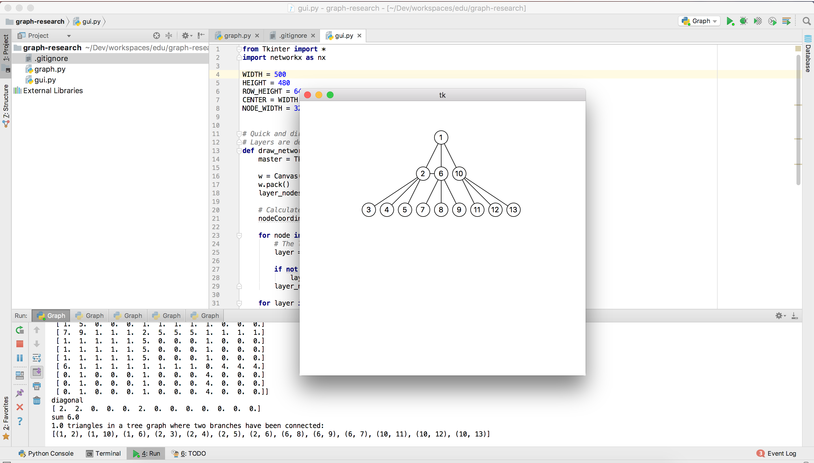

# research-graphs
A repository containing python code related to the research of graph structures

This is a work-in-progress repository.

# Getting Started
This package depends on numpy and networkx. Both can be installed using pip.