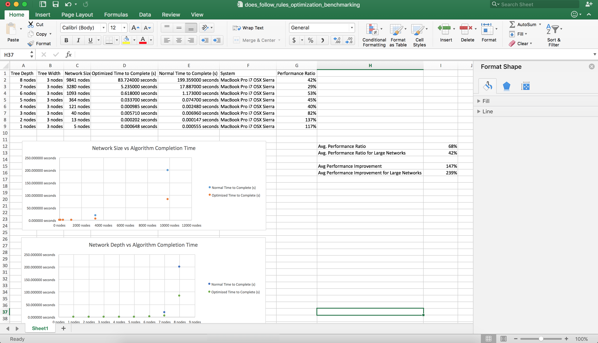

# research-graphs
A repository containing python code related to the research of graph structures

This is a work-in-progress repository.

Research is currently being performed into optimizing certain types of graph algorithms.

# Getting Started
This package depends on numpy and networkx. Both can be installed using pip.

# Intellectual Property
All code and data in this repository is subject to copyright (c) 2017 [Jake Billings].

Some work is derivative of Dr. Michael Huntington's PHD dissertation at the University of Wyoming. All intellectual property derived directly from work in this dissertation belongs to Dr. Michael Huntington.

See LICENSE for more information